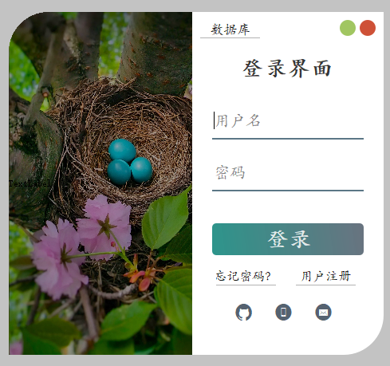
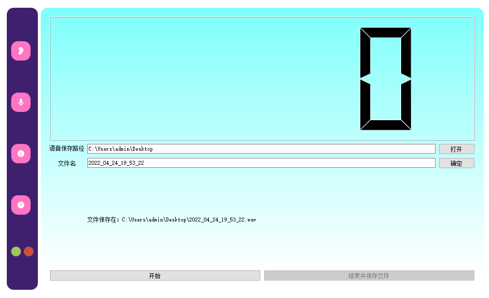
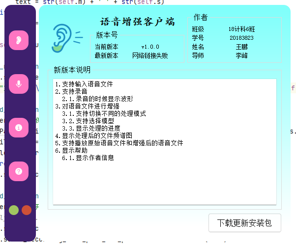
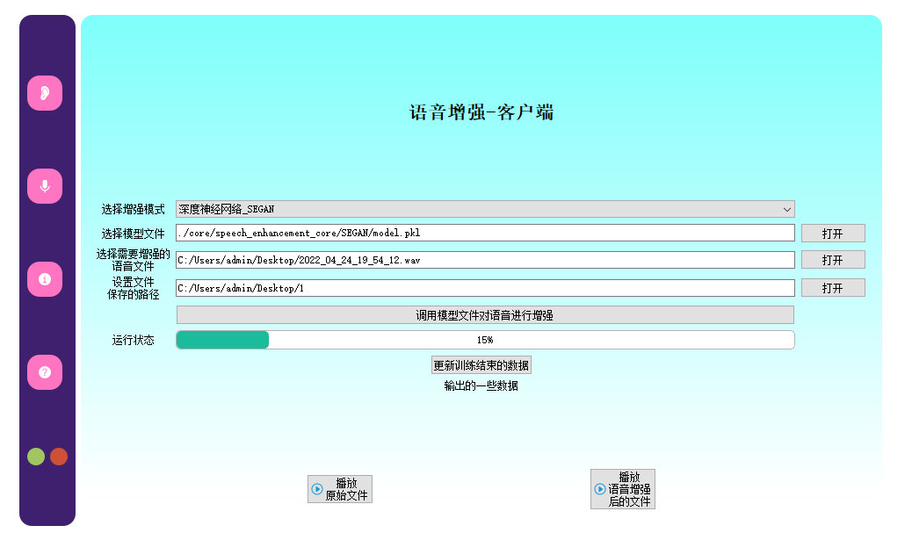
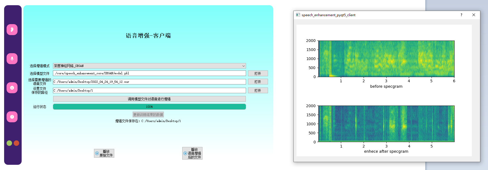
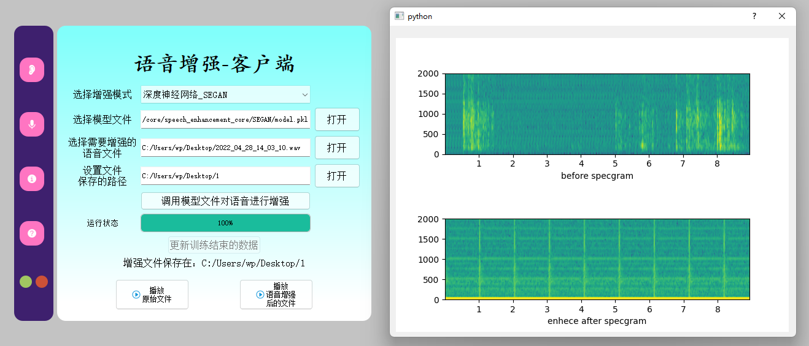
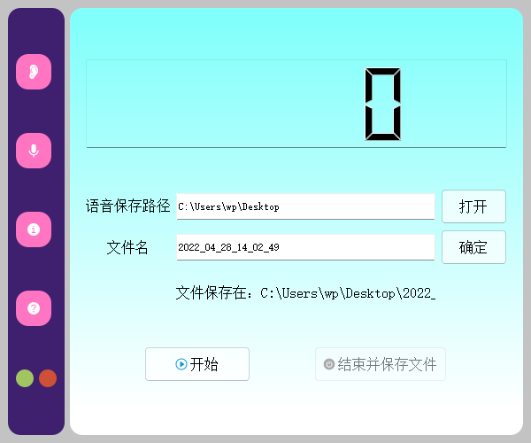
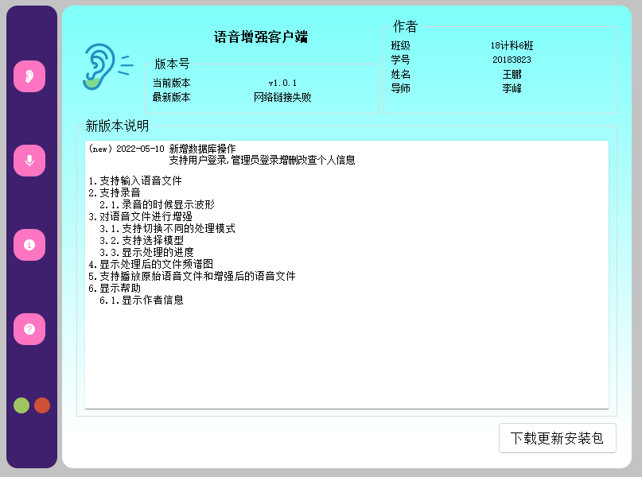

## 语音增强客户端

## 项目结构

- 具体参考我写的这个项目的框架来建立的
- `https://github.com/wp19991/PyQt5_example`

- doc (文档相关)
- config (程序初始化配置相关)
    - skin (存放皮肤的文件夹)
    - config.toml (配置文件)
    - core.py (处理配置文件的类)
    - logs.py (全局的log显示处理)
- core (核心)
    - speech_enhancement_core (语音增强核心库)
    - MySystemTrayIcon.py (自定义的系统托盘图标类)
- res (程序使用的资源文件夹)
    - app.qrc (qt-designer💻编辑的资源集合文件)
    - app_rc.py (pyrcc5转换的资源文件,🚫不要修改)
- ui (程序的ui文件夹)
    - about_frame.ui (关于界面)
    - help_frame.ui (帮助界面)
    - login_form.ui (登录界面)
    - register_form.ui (注册界面)
    - mysql_form.ui (数据库管理界面)
    - main_widget.ui (语音增强界面)
    - sound_recording_frame.ui (录音界面)
    - close_dialog.ui (关闭提示界面)
    - main_window.ui 主窗口文件)
- models (数据库相关文件夹)
    - db.sql (生成数据库文件)
    - user.py (用户表事务逻辑)
- utils (工具类的文件夹)
    - CommonHelper.py (公共帮助类)
    - global_var.py (全局变量类)
    - connect_mysql.py (连接数据库)
- win (窗口逻辑文件夹)
    - splash (软件启动画面，用于提前加载深度血虚库)
    - close_dialog.py (关闭按钮提示框的处理逻辑)
    - main_win.py (主窗口的逻辑处理)
    - about_form.py (关于窗口的逻辑处理)
    - help_form.py (帮助窗口的逻辑处理)
    - login_form.py (登录界面的逻辑处理)
    - register_form.py (注册界面的逻辑处理)
    - mysql_form.py (数据库管理界面的逻辑处理)
    - main_widget.py (语音增强窗口的逻辑处理)
    - sound_recording_frame.py (录音窗口的逻辑处理)
- app.py(程序入口文件)
- .gitignore(git上传忽略的文件)
- file_verison_info.txt(软件的版本信息)
- LICENSE(项目支持的开源协议)
- PyAudio-0.2.11-cp38-cp38-win_amd64.whl(语音处理的第三方库)
- speech_enhancement_pyqt5_client.spec(pyinstaller打包使用的文件)
- requirements.txt(项目依赖库)
- ui_to_py.bat
    - ！注意修改coda环境路径
    - 启动💻自动使用pyuic与pyrcc5转换ui文件
- 启动qt-designer.bat
    - ！注意修改coda环境路径
    - 启动💻qt-designer工具
- README.md(项目说明文件)

## 基本界面











## 功能介绍

- 输入语音文件
    - [√]打开文件
    - [√]输入路径

- 录音
    - [×]选择录音设备
    - [√]显示当前录音的大小状态（是否进行录音）

- 进行处理
    - [√]切换不同的处理
    - [√]选择模型
    - [√]进行处理的按钮
    - [√]显示处理的进度

- 保存处理好的语音文件
    - [√]选择输出目录

- 播放语音文件
    - [√]播放语音文件
    - [×]控制声音大小

- 显示图片plt
    - [√]显示处理进度
    - [√]噪音的图片
    - [√]处理之后的图片

- 显示帮助
    - [√]显示作者信息
    - [√]显示帮助文档

## Environmental installation

```bash
# 创建conda环境
conda create -n bysj python=3.8
# 激活conda环境
conda activate bysj

# Installation Library
pip install -r requirements.txt

# 修改mysql服务器配置信息
# 在 `/config/config.toml` 文件中
[mysql]
host = "127.0.0.1"
port = 3306
user = "root"
password = "password"
database = 'bysj_db'

# 数据库添加数据库
# 数据库中运行 `/model/db.sql` 文件

# 需要下载模型文件model.pkl保存到下面的目录里面
# 下载地址：https://wp19991.oss-cn-hangzhou.aliyuncs.com/model.pkl
/core/speech_enhancement_core/SEGAN/model.pkl

# 安装PyAudio
# pyaudio安装不上的话就去官网（https://pypi.org/）下载whl文件，然后pip install *.whl
pip install res/PyAudio-0.2.11-cp38-cp38-win_amd64.whl

# 打包成可执行文件
pyinstaller speech_enhancement_pyqt5_client.spec
```